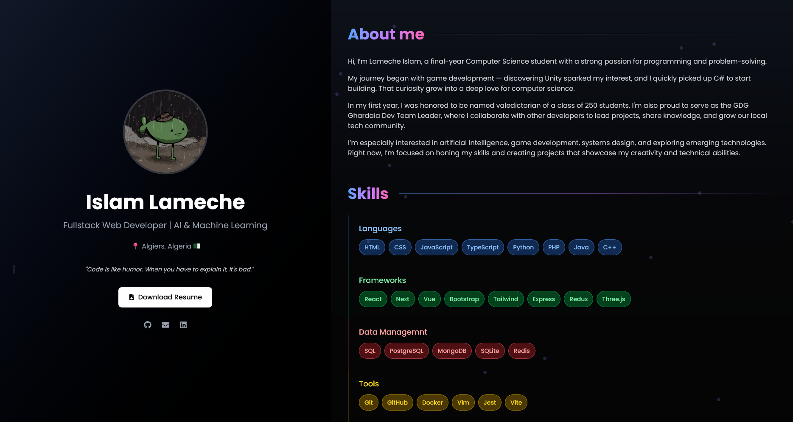

# Minimalist Portfolio

[](https://thesofishticatedman.me)
[](./LICENSE)
[](https://github.com/The-Sofishticated-Man/The-Sofishticated-Man.github.io/commits/main)
[](https://nextjs.org/)
[](https://pages.github.com/)
[](https://github.com/The-Sofishticated-Man/The-Sofishticated-Man.github.io/issues)

---

## ✨ About

**Minimalist Portfolio**: clean, distraction-free personal website built with [Next.js](https://nextjs.org/) and deployed via [GitHub Pages](https://pages.github.com/) using [GitHub Actions](https://github.com/features/actions).



It serves as a professional portfolio to highlight your:

- 🧠 Experience  
- 🎓 Education  
- 🚀 Projects  

📍 **Live Demo**: [thesofishticatedman.me](https://thesofishticatedman.me)

---

## 🛠️ Tech Stack

- **Framework**: [Next.js](https://nextjs.org/)
- **Language**: TypeScript (if applicable)
- **Styling**: Tailwind CSS
- **Deployment**: GitHub Pages
- **CI/CD**: GitHub Actions

---

## 🚀 Getting Started

### 1. Clone the Repository

```bash
git clone https://github.com/The-Sofishticated-Man/minimalist-portfolio.git
cd minimalist-portfolio
```
### 2. Install Dependencies
```bash
npm install
```
### 3. Start the Development Server
```bash
npm run dev
```
### 4. Deployment

Deployment is automated using **GitHub Actions**. Every push to the `main` branch triggers you can find my action's script [here](https://github.com/The-Sofishticated-Man/The-Sofishticated-Man.github.io/blob/main/.github/workflows/nextjs.yml):

1. A production build
2. Exporting static files
3. Deployment to GitHub Pages

### Manual Deployment (Optional)

To deploy manually:

```bash
yarn build
```
Then copy the contents of the `out/` directory to your GitHub Pages repository (yourusername.github.io) and push.

## 🙌 Credits
This project was inspired by the minimalist portfolio concept by
[@OskarFranttiGlen](https://github.com/OskarFranttiGlen) — big thanks for the clean design approach and layout inspiration.

## 📄 License
This project is licensed under the [MIT License](./LICENSE).
You’re free to use, modify, and distribute it — just keep the license file.
